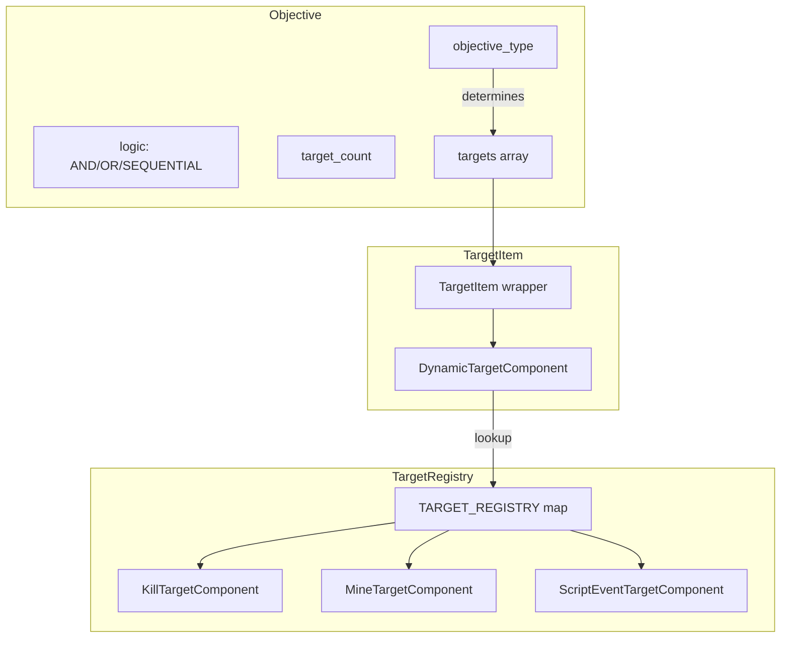
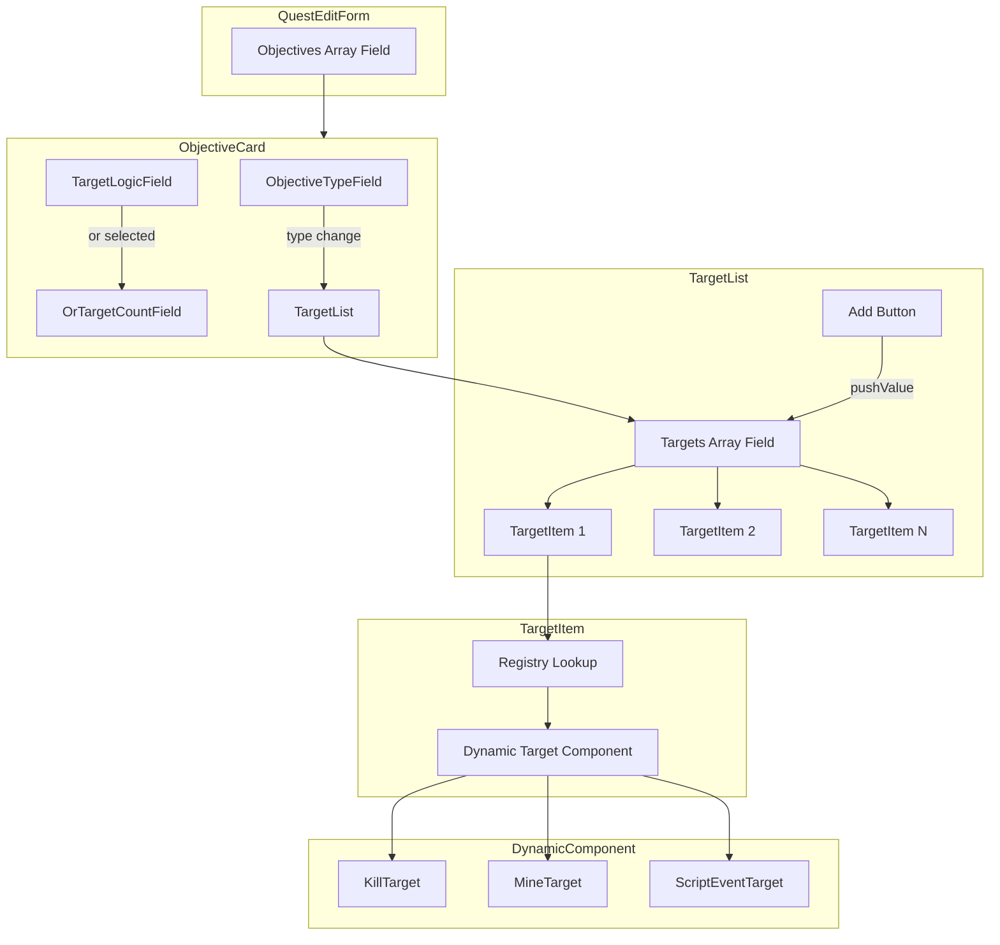

# Modular Target Fields Architecture

## Overview

This plan outlines the refactoring of the Quest form's target system to be modular and extensible. The goal is to create a registry-based architecture where each objective type maps to its own target component, making it easy to add new target types in the future.

### Current State

- Objectives have an `objective_type` field: `kill`, `mine`, `scriptevent`
- Each objective contains an array of `targets` that inherit the objective type
- Targets have type-specific fields:
  - **Kill**: `entity` + `count`
  - **Mine**: `block` + `count`
  - **ScriptEvent**: `script_id` + `count`
- Objectives have `logic` field: `and`, `or`, `sequential`
- Objectives have `target_count` field: only used when logic is `or`

### Target Architecture



---

## Directory Structure

```
src/components/features/quests/
├── fields/
│   ├── objective/
│   │   ├── description.tsx          # Existing
│   │   ├── objective-type.tsx       # Existing - needs modification
│   │   ├── target-count.tsx         # Existing - rename to count-field.tsx
│   │   ├── target-logic.tsx         # NEW - AND/OR/SEQUENTIAL selector
│   │   └── target-list.tsx          # NEW - manages array of targets
│   └── targets/
│       ├── index.ts                 # Registry and exports
│       ├── types.ts                 # TypeScript interfaces
│       ├── target-item.tsx          # Wrapper component for individual target
│       ├── kill-target.tsx          # Kill target fields
│       ├── mine-target.tsx          # Mine target fields
│       └── scriptevent-target.tsx   # ScriptEvent target fields
```

---

## Component Interface Definitions

### Target Component Props

```typescript
// src/components/features/quests/fields/targets/types.ts

import { TargetFormValues } from '@/lib/schemas/quest-form';

/**
 * Props passed to each target type component
 */
export interface TargetComponentProps {
  /** The objective index in the form array */
  objectiveIndex: number;
  /** The target index within the objective's targets array */
  targetIndex: number;
  /** Callback to remove this target */
  onRemove: () => void;
}

/**
 * Configuration for a target type in the registry
 */
export interface TargetTypeConfig {
  /** The component to render for this target type */
  component: React.ComponentType<TargetComponentProps>;
  /** Default values when creating a new target of this type */
  defaultValues: Partial<TargetFormValues>;
  /** Human-readable label for this target type */
  label: string;
}

/**
 * Objective types that have target components
 */
export type ObjectiveType = 'kill' | 'mine' | 'scriptevent';

/**
 * The target registry type
 */
export type TargetRegistry = Record<ObjectiveType, TargetTypeConfig>;
```

### Target List Props

```typescript
// Props for the TargetList component
export interface TargetListProps {
  /** The objective index in the form array */
  objectiveIndex: number;
  /** The current objective type - determines which target component to render */
  objectiveType: ObjectiveType;
}
```

---

## Registry Implementation

### Target Registry

```typescript
// src/components/features/quests/fields/targets/index.ts

import { TargetRegistry, TargetTypeConfig } from './types';
import { KillTarget } from './kill-target';
import { MineTarget } from './mine-target';
import { ScriptEventTarget } from './scriptevent-target';

/**
 * Registry mapping objective types to their target configurations.
 * 
 * To add a new target type:
 * 1. Create a new component file: new-type-target.tsx
 * 2. Add the type to ObjectiveType union in types.ts
 * 3. Add the schema to quest-form.tsx discriminated union
 * 4. Register it here with component and default values
 */
export const TARGET_REGISTRY: TargetRegistry = {
  kill: {
    component: KillTarget,
    defaultValues: {
      target_type: 'kill',
      count: 1,
      entity: '',
    },
    label: 'Kill Target',
  },
  mine: {
    component: MineTarget,
    defaultValues: {
      target_type: 'mine',
      count: 1,
      block: '',
    },
    label: 'Mine Target',
  },
  scriptevent: {
    component: ScriptEventTarget,
    defaultValues: {
      target_type: 'scriptevent',
      count: 1,
      script_id: '',
    },
    label: 'Script Event Target',
  },
};

/**
 * Get the target configuration for an objective type
 */
export function getTargetConfig(type: ObjectiveType): TargetTypeConfig {
  return TARGET_REGISTRY[type];
}

/**
 * Get default target values for an objective type
 */
export function getDefaultTarget(type: ObjectiveType): TargetFormValues {
  return TARGET_REGISTRY[type].defaultValues as TargetFormValues;
}
```

---

## Component Implementations

> **Critical: Form Prop Pattern**
> 
> Components using `withQuestForm` require the `form` prop to be passed explicitly when rendered outside of `form.AppField`. The data flow is:
> 
> ```
> QuestObjectiveCard (has form) 
>   → TargetList (receives form prop)
>     → TargetItem (receives form prop)
>       → KillTarget/MineTarget/etc. (receives form prop)
> ```
> 
> Each component in this chain must pass `form={form}` to its children that use `withQuestForm`.

### TargetItem - Wrapper Component

The `TargetItem` component wraps individual targets with drag handle and remove button. **Important:** It receives the `form` prop and passes it to the dynamic target component, which is required for `withQuestForm` components to work correctly.

```typescript
// src/components/features/quests/fields/targets/target-item.tsx

import { TARGET_REGISTRY } from './index';
import { TargetComponentProps, ObjectiveType } from './types';
import { Card } from '@/components/ui/card';
import { Button } from '@/components/ui/button';
import { TrashIcon, DotsSixVertical } from '@phosphor-icons/react';

interface TargetItemProps extends TargetComponentProps {
  objectiveType: ObjectiveType;
  form: any; // Form instance from withQuestForm - required for target components
}

export function TargetItem({ 
  objectiveIndex, 
  targetIndex, 
  objectiveType,
  onRemove,
  form
}: TargetItemProps) {
  const config = TARGET_REGISTRY[objectiveType];
  const TargetComponent = config.component;

  return (
    <Card className="p-2 flex items-center gap-2">
      {/* Drag handle for sortable */}
      <Button variant="ghost" size="icon-sm" className="cursor-grab">
        <DotsSixVertical />
      </Button>

      {/* Dynamic target component - MUST pass form prop */}
      <div className="flex-1">
        <TargetComponent
          form={form}
          objectiveIndex={objectiveIndex}
          targetIndex={targetIndex}
          onRemove={onRemove}
        />
      </div>

      {/* Remove button */}
      <Button
        variant="ghost"
        size="icon-sm"
        onClick={onRemove}
        className="text-muted-foreground hover:text-destructive"
      >
        <TrashIcon />
      </Button>
    </Card>
  );
}
```

### KillTarget Component

```typescript
// src/components/features/quests/fields/targets/kill-target.tsx

import { TargetComponentProps } from './types';
import { withQuestForm } from '@/components/features/quests/quest-form';

export const KillTarget = withQuestForm({
  props: {} as TargetComponentProps,
  
  render: function Render({ form, objectiveIndex, targetIndex }) {
    const basePath = `objectives[${objectiveIndex}].targets[${targetIndex}]`;
    
    return (
      <div className="flex gap-2 items-center">
        {/* Entity field */}
        <form.AppField
          name={`${basePath}.entity`}
          children={(field) => <field.EntityField />}
        />
        
        {/* Count field */}
        <form.AppField
          name={`${basePath}.count`}
          children={(field) => <field.CountField />}
        />
      </div>
    );
  }
});
```

### MineTarget Component

```typescript
// src/components/features/quests/fields/targets/mine-target.tsx

import { TargetComponentProps } from './types';
import { withQuestForm } from '@/components/features/quests/quest-form';

export const MineTarget = withQuestForm({
  props: {} as TargetComponentProps,
  
  render: function Render({ form, objectiveIndex, targetIndex }) {
    const basePath = `objectives[${objectiveIndex}].targets[${targetIndex}]`;
    
    return (
      <div className="flex gap-2 items-center">
        {/* Block field */}
        <form.AppField
          name={`${basePath}.block`}
          children={(field) => <field.BlockField />}
        />
        
        {/* Count field */}
        <form.AppField
          name={`${basePath}.count`}
          children={(field) => <field.CountField />}
        />
      </div>
    );
  }
});
```

### ScriptEventTarget Component

```typescript
// src/components/features/quests/fields/targets/scriptevent-target.tsx

import { TargetComponentProps } from './types';
import { withQuestForm } from '@/components/features/quests/quest-form';

export const ScriptEventTarget = withQuestForm({
  props: {} as TargetComponentProps,
  
  render: function Render({ form, objectiveIndex, targetIndex }) {
    const basePath = `objectives[${objectiveIndex}].targets[${targetIndex}]`;
    
    return (
      <div className="flex gap-2 items-center">
        {/* Script ID field */}
        <form.AppField
          name={`${basePath}.script_id`}
          children={(field) => <field.ScriptIdField />}
        />
        
        {/* Count field */}
        <form.AppField
          name={`${basePath}.count`}
          children={(field) => <field.CountField />}
        />
      </div>
    );
  }
});
```

### TargetList Component

The `TargetList` manages the array of targets. It uses `withQuestForm` and **passes the `form` prop down to each `TargetItem`**, which is essential for the target components to work.

```typescript
// src/components/features/quests/fields/objective/target-list.tsx

import { withQuestForm } from '@/components/features/quests/quest-form';
import { TargetItem } from '../targets/target-item';
import { getDefaultTarget, TARGET_REGISTRY } from '../targets';
import { ObjectiveType } from '../targets/types';
import { Button } from '@/components/ui/button';
import { PlusIcon } from '@phosphor-icons/react';
import { Sortable, SortableContent, SortableItem } from '@/components/ui/sortable';

interface TargetListProps {
  objectiveIndex: number;
  objectiveType: ObjectiveType;
}

export const TargetList = withQuestForm({
  props: {} as TargetListProps,
  
  render: function Render({ form, objectiveIndex, objectiveType }) {
    return (
      <form.AppField name={`objectives[${objectiveIndex}].targets`} mode="array">
        {(field) => (
          <div className="flex flex-col gap-2">
            <Sortable
              value={field.state.value}
              onValueChange={(newValue) => field.setValue(newValue)}
            >
              <SortableContent className="grid gap-2">
                {field.state.value.map((_, targetIndex) => (
                  <SortableItem key={targetIndex} value={targetIndex}>
                    <TargetItem
                      form={form}
                      objectiveIndex={objectiveIndex}
                      targetIndex={targetIndex}
                      objectiveType={objectiveType}
                      onRemove={() => field.removeValue(targetIndex)}
                    />
                  </SortableItem>
                ))}
              </SortableContent>
            </Sortable>

            <Button
              variant="outline"
              size="sm"
              type="button"
              onClick={() => field.pushValue(getDefaultTarget(objectiveType))}
            >
              <PlusIcon className="mr-2 size-4" />
              Add Target
            </Button>
          </div>
        )}
      </form.AppField>
    );
  }
});
```

---

## Objective Type Change Handling

When the objective type changes, all targets must be reset to a single default target of the new type.

### Modified ObjectiveTypeField

```typescript
// src/components/features/quests/fields/objective/objective-type.tsx

import { Field, FieldError, FieldLabel } from '@/components/ui/field';
import { useFieldContext, useFormContext } from '@/hooks/use-form-context';
import { SeamlessSelect } from '@/components/features/common/seamless-select';
import { OBJECTIVE_TYPES } from '@/config/quest-form-options';
import { getDefaultTarget } from '../targets';
import { ObjectiveType } from '../targets/types';

interface ObjectiveTypeFieldProps {
  objectiveIndex: number;
}

export function ObjectiveTypeField({ objectiveIndex }: ObjectiveTypeFieldProps) {
  const field = useFieldContext<string>();
  const form = useFormContext();

  const isInvalid = field.state.meta.isTouched && !field.state.meta.isValid;

  const handleTypeChange = (newType: string) => {
    const oldType = field.state.value;
    
    // Update the objective type
    field.handleChange(newType);
    
    // Reset targets to a single default target of the new type
    if (oldType !== newType) {
      const defaultTarget = getDefaultTarget(newType as ObjectiveType);
      form.setFieldValue(
        `objectives[${objectiveIndex}].targets`,
        [defaultTarget]
      );
    }
  };

  return (
    <Field className="w-fit">
      <FieldLabel className="sr-only">Objective Type</FieldLabel>
      <SeamlessSelect
        options={OBJECTIVE_TYPES}
        value={field.state.value}
        onValueChange={handleTypeChange}
        placeholder="Objective Type"
      />
      {isInvalid && <FieldError errors={field.state.meta.errors} />}
    </Field>
  );
}
```

---

## Target Logic Implementation

### TargetLogicField Component

```typescript
// src/components/features/quests/fields/objective/target-logic.tsx

import { Field, FieldError, FieldLabel } from '@/components/ui/field';
import { useFieldContext } from '@/hooks/use-form-context';
import { SeamlessSelect } from '@/components/features/common/seamless-select';

const LOGIC_OPTIONS = [
  { value: 'and', label: 'AND', info: 'All targets must be completed' },
  { value: 'or', label: 'OR', info: 'Any N targets must be completed' },
  { value: 'sequential', label: 'Sequential', info: 'Targets must be completed in order' },
];

export function TargetLogicField() {
  const field = useFieldContext<string>();
  const isInvalid = field.state.meta.isTouched && !field.state.meta.isValid;

  return (
    <Field className="w-fit">
      <FieldLabel className="sr-only">Target Logic</FieldLabel>
      <SeamlessSelect
        options={LOGIC_OPTIONS}
        value={field.state.value}
        onValueChange={(e) => field.handleChange(e)}
        placeholder="Logic"
      />
      {isInvalid && <FieldError errors={field.state.meta.errors} />}
    </Field>
  );
}
```

### TargetCountField - For OR Logic

The `target_count` field is only relevant when logic is `or`. It specifies how many targets need to be completed.

```typescript
// src/components/features/quests/fields/objective/or-target-count.tsx

import { Field, FieldError, FieldLabel } from '@/components/ui/field';
import { Input } from '@/components/ui/input';
import { useFieldContext, useFormContext } from '@/hooks/use-form-context';

interface OrTargetCountFieldProps {
  objectiveIndex: number;
}

export function OrTargetCountField({ objectiveIndex }: OrTargetCountFieldProps) {
  const field = useFieldContext<number | null>();
  const form = useFormContext();
  
  // Get the current logic value
  const logic = form.getFieldValue(`objectives[${objectiveIndex}].logic`);
  
  // Only show when logic is 'or'
  if (logic !== 'or') {
    return null;
  }

  const isInvalid = field.state.meta.isTouched && !field.state.meta.isValid;

  return (
    <Field className="w-24">
      <FieldLabel className="sr-only">Required Count</FieldLabel>
      <Input
        type="number"
        min={1}
        value={field.state.value ?? ''}
        onChange={(e) => field.handleChange(parseInt(e.target.value) || null)}
        placeholder="N"
      />
      {isInvalid && <FieldError errors={field.state.meta.errors} />}
    </Field>
  );
}
```

---

## Updated Objective Card

```typescript
// src/components/features/quests/fields/objective.tsx

import { Card, CardContent, CardHeader, CardTitle } from '@/components/ui/card';
import { Button } from '@/components/ui/button';
import { CaretDownIcon, TrashIcon } from '@phosphor-icons/react';
import { withQuestForm } from '@/components/features/quests/quest-form';
import { Collapsible, CollapsibleContent, CollapsibleTrigger } from '@/components/ui/collapsible';
import { useState } from 'react';
import { cn } from '@/lib/utils';
import { TargetList } from './objective/target-list';
import { ObjectiveType } from './targets/types';

export const QuestObjectiveCard = withQuestForm({
  props: {
    index: 0,
    onRemove: () => {},
  },

  render: function Render({ form, index, onRemove }) {
    const [open, setOpen] = useState(false);
    
    // Get current objective type for target rendering
    const objectiveType = form.getFieldValue(
      `objectives[${index}].objective_type`
    ) as ObjectiveType;

    return (
      <Collapsible open={open} onOpenChange={setOpen}>
        <Card className="p-0 gap-0 transition-all overflow-hidden">
          <CollapsibleTrigger asChild>
            <CardHeader className="p-2 flex flex-row items-center justify-between space-y-0 group hover:bg-input/10">
              <div className="flex items-center gap-2">
                <Button variant="invisible" size="icon-sm" />
                <CardTitle className="font-medium flex gap-2 items-center">
                  Objective #{index + 1}
                  <CaretDownIcon
                    className={cn(
                      'transition-all duration-75 group-hover:font-bold',
                      open ? 'rotate-180' : ''
                    )}
                  />
                </CardTitle>
              </div>

              <Button
                variant="ghost"
                size="icon"
                className="h-8 w-8 text-muted-foreground opacity-0 group-hover:opacity-100 hover:text-destructive"
                onClick={onRemove}
                type="button"
              >
                <TrashIcon className="size-4" />
              </Button>
            </CardHeader>
          </CollapsibleTrigger>

          <CollapsibleContent asChild>
            <CardContent className="p-2 grid gap-4">
              {/* Description */}
              <form.AppField
                name={`objectives[${index}].description`}
                children={(field) => <field.ObjectiveDescriptionField />}
              />

              {/* Objective Type + Logic Row */}
              <div className="flex gap-2 flex-wrap">
                <form.AppField
                  name={`objectives[${index}].objective_type`}
                  children={(field) => (
                    <field.ObjectiveTypeField objectiveIndex={index} />
                  )}
                />

                <form.AppField
                  name={`objectives[${index}].logic`}
                  children={(field) => <field.TargetLogicField />}
                />

                <form.AppField
                  name={`objectives[${index}].target_count`}
                  children={(field) => (
                    <field.OrTargetCountField objectiveIndex={index} />
                  )}
                />
              </div>

              {/* Targets List */}
              {objectiveType && (
                <TargetList
                  form={form}
                  objectiveIndex={index}
                  objectiveType={objectiveType}
                />
              )}
            </CardContent>
          </CollapsibleContent>
        </Card>
      </Collapsible>
    );
  },
});
```

---

## Schema Changes

No schema changes are required. The existing discriminated union in [`quest-form.tsx`](src/lib/schemas/quest-form.tsx:58) already supports the target types:

```typescript
export const targetSchema = z.discriminatedUnion("target_type", [
    killTargetSchema,
    mineTargetSchema,
    scriptEventTargetSchema,
]);
```

To add new target types in the future:
1. Add a new schema to the discriminated union
2. Add the type to [`quests.d.ts`](src/types/quests.d.ts:58)
3. Create the component and register it

---

## Quest Form Registration

Update [`quest-form.ts`](src/components/features/quests/quest-form.ts:1) to include new field components:

```typescript
// src/components/features/quests/quest-form.ts

import { createFormHook } from '@tanstack/react-form';
import { fieldContext, formContext } from '@/hooks/use-form-context';

// Existing fields
import { QuestTitleField } from './fields/title';
import { QuestTypeField } from './fields/quest-type';
import { QuestTimeField } from './fields/time-range';
import { QuestDescriptionField } from './fields/description';
import { QuestTagsField } from './fields/tags';
import { ObjectiveDescriptionField } from './fields/objective/description';
import { ObjectiveTypeField } from './fields/objective/objective-type';

// New fields
import { TargetLogicField } from './fields/objective/target-logic';
import { OrTargetCountField } from './fields/objective/or-target-count';
import { CountField } from './fields/targets/count-field';
import { EntityField } from './fields/targets/entity-field';
import { BlockField } from './fields/targets/block-field';
import { ScriptIdField } from './fields/targets/script-id-field';

export const { useAppForm: useQuestForm, withForm: withQuestForm } = createFormHook({
  fieldContext,
  formContext,
  fieldComponents: {
    // Quest-level fields
    QuestTitleField,
    QuestTypeField,
    QuestTimeField,
    QuestDescriptionField,
    QuestTagsField,
    
    // Objective-level fields
    ObjectiveDescriptionField,
    ObjectiveTypeField,
    TargetLogicField,
    OrTargetCountField,
    
    // Target-level fields
    CountField,
    EntityField,
    BlockField,
    ScriptIdField,
  },
  formComponents: {},
});
```

---

## Implementation Tasks

### Phase 1: Foundation

- [ ] Create `src/components/features/quests/fields/targets/` directory
- [ ] Create `types.ts` with TypeScript interfaces
- [ ] Create `index.ts` with registry and helper functions
- [ ] Create `count-field.tsx` - shared count input for all target types

### Phase 2: Target Components

- [ ] Create `entity-field.tsx` - entity selector/input for Kill targets
- [ ] Create `block-field.tsx` - block selector/input for Mine targets
- [ ] Create `script-id-field.tsx` - script ID input for ScriptEvent targets
- [ ] Create `kill-target.tsx` - Kill target composite component
- [ ] Create `mine-target.tsx` - Mine target composite component
- [ ] Create `scriptevent-target.tsx` - ScriptEvent target composite component

### Phase 3: Target Management

- [ ] Create `target-item.tsx` - wrapper component with drag handle and remove button
- [ ] Create `target-list.tsx` - manages array of targets with add/remove/reorder

### Phase 4: Objective Integration

- [ ] Create `target-logic.tsx` - AND/OR/SEQUENTIAL selector
- [ ] Create `or-target-count.tsx` - conditional count field for OR logic
- [ ] Modify `objective-type.tsx` - add target reset on type change
- [ ] Update `objective.tsx` - integrate new target components

### Phase 5: Form Registration

- [ ] Update `quest-form.ts` - register all new field components
- [ ] Update `quest-form-options.ts` - add logic options if needed

### Phase 6: Testing & Polish

- [ ] Test objective type switching resets targets correctly
- [ ] Test AND/OR/SEQUENTIAL logic switching
- [ ] Test target_count visibility with OR logic
- [ ] Test adding/removing/reordering targets
- [ ] Verify form validation works with discriminated union

---

## Data Flow Diagram



---

## Adding New Target Types

To add a new target type, such as `visit`:

1. **Schema** - Add to [`quest-form.tsx`](src/lib/schemas/quest-form.tsx:58):
   ```typescript
   const visitTargetSchema = z.object({
     target_type: z.literal('visit'),
     count: z.coerce.number().min(1),
     location: z.tuple([z.number(), z.number(), z.number()]),
     radius: z.number().min(1),
   });
   
   export const targetSchema = z.discriminatedUnion('target_type', [
     killTargetSchema,
     mineTargetSchema,
     scriptEventTargetSchema,
     visitTargetSchema, // Add here
   ]);
   ```

2. **Types** - Add to [`quests.d.ts`](src/types/quests.d.ts:58):
   ```typescript
   export interface VisitTargetModel {
     target_uuid?: string;
     target_type: 'visit';
     count: number;
     location: [number, number, number];
     radius: number;
   }
   
   export type Target = MineTargetModel | KillTargetModel | ScriptEventTargetModel | VisitTargetModel;
   ```

3. **Component** - Create `visit-target.tsx`:
   ```typescript
   export const VisitTarget = withQuestForm({
     props: {} as TargetComponentProps,
     render: function Render({ form, objectiveIndex, targetIndex }) {
       // Implementation
     }
   });
   ```

4. **Registry** - Add to `index.ts`:
   ```typescript
   export const TARGET_REGISTRY: TargetRegistry = {
     // ... existing
     visit: {
       component: VisitTarget,
       defaultValues: {
         target_type: 'visit',
         count: 1,
         location: [0, 0, 0],
         radius: 10,
       },
       label: 'Visit Target',
     },
   };
   ```

5. **Options** - Add to [`quest-form-options.ts`](src/config/quest-form-options.ts:45) if not already present

---

## Notes

- The `withQuestForm` HOC pattern from [`quest-form.ts`](src/components/features/quests/quest-form.ts:12) is used consistently
- Field components use `useFieldContext` from [`use-form-context.ts`](src/hooks/use-form-context.ts:6)
- The existing `Sortable` component from [`sortable.tsx`](src/components/ui/sortable.tsx) handles drag-and-drop reordering
- Target components are intentionally simple - they just compose the field components
- The registry pattern allows for easy extension without modifying existing code
